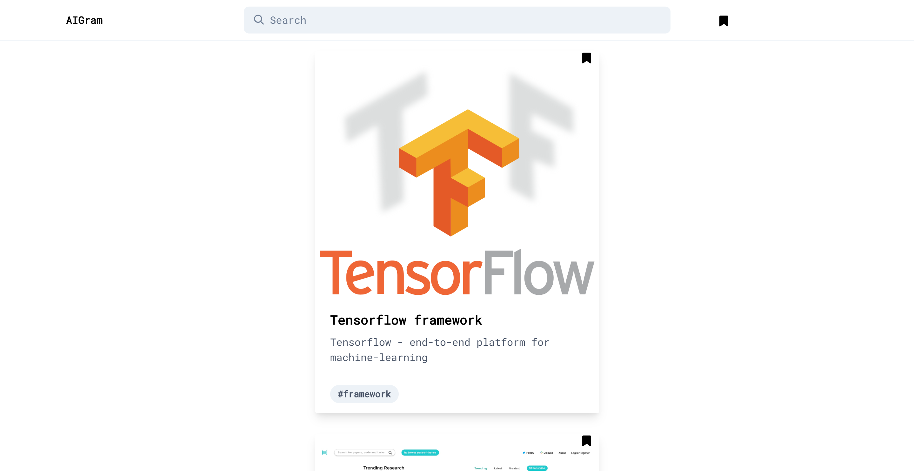

<!-- PROJECT LOGO -->
<br />
<p align="center">
  <a href="https://github.com/AIGramApp/AIGram-web">
    
  </a>

  <h3 align="center">AIGram</h3>

  <p align="center">
    Instagram for everything AI-related
    <br />
    <br />
    <a href="https://aigram.ilkinmusayev.com">View Demo</a>
    ·
    <a href="https://github.com/AIGramApp/AIGram-web/issues">Report Bug</a>
    ·
    <a href="https://github.com/AIGramApp/AIGram-web/issues">Request Feature</a>
  </p>
</p>


<!-- TABLE OF CONTENTS -->
## Table of Contents

* [About the Project](#about-the-project)
  * [Built With](#built-with)
* [Getting Started](#getting-started)
  * [Prerequisites](#prerequisites)
  * [Installation](#installation)
* [Usage](#usage)
* [How to add data](#how-to-add-data)
* [Roadmap](#roadmap)
* [Contributing](#contributing)
* [License](#license)
* [Contact](#contact)
* [Acknowledgements](#acknowledgements)


<!-- ABOUT THE PROJECT -->
## About The Project



The aim of the this project is to gather all the resources about the AI industry in instagram style (posts, comments etc.)

### Built With

* [Vue.Js](https://vuejs.org/)
* [TailwindCSS](https://tailwindcss.com/)


<!-- GETTING STARTED -->
## Getting Started

To get a local copy up and running follow these simple steps.

### Prerequisites

You only need node.js and npm to run the project.
* npm
```sh
npm install npm@latest -g
```

### Installation
 
1. Clone the repo
```sh
git clone https://github.com/AIGramApp/AIGram-web.git
```
2. Install NPM packages
```sh
npm install
```
3. Run the local server:
```sh
npm run serve
```
4. After you are done with development, run for production using the following command:
```sh
npm run build
```


<!-- USAGE EXAMPLES -->
## Usage

The project will be developed in several stages. The first stage only includes frontend for the project. Currently the following features have been implemented:
- [x] Loading of data from api
- [x] Display feed of data
- [x] Bookmark items
- [x] Display bookmarked items
- [x] Search across the posts
- [x] Login/register with Github
- [x] Add posts via api
- [x] User profiles

## How to add data

Visit the demo link and login with Github. Then press the +Publish button, upload the photo, fill out the information and the post will be created in a matter of seconds.

<!-- ROADMAP -->
## Roadmap

See the [open issues](https://github.com/AIGramApp/AIGram-web/issues) for a list of proposed features (and known issues).

The project will include lots of features in next stages.

### Second stage
- [x] Backend where new posts can be added along with the timestamp
- [ ] Lazy loading of the feed
- [x] Image storage for the posts
- [x] Registration for users (using github)
- [x] Profiles for different users

### Third stage:
- [ ] Mobile application written in Flutter
- [ ] Comments
- [ ] CLI for consuming the api from command line

<!-- CONTRIBUTING -->
## Contributing

Contributions are what make the open source community such an amazing place to be learn, inspire, and create. Any contributions you make are **greatly appreciated**.

1. Fork the Project
2. Create your Feature Branch (`git checkout -b feature/AmazingFeature`)
3. Commit your Changes (`git commit -m 'Add some AmazingFeature'`)
4. Push to the Branch (`git push origin feature/AmazingFeature`)
5. Open a Pull Request

<!-- LICENSE -->
## License

Distributed under the MIT License. See `LICENSE` for more information.


<!-- CONTACT -->
## Contact

Ilkin Musayev - [@real_paladium](https://twitter.com/real_paladium) - musaevilkin29@gmail.com

Project Link: [https://github.com/AIGramApp/AIGram-web](https://github.com/AIGramApp/AIGram-web)


<!-- ACKNOWLEDGEMENTS -->
## Acknowledgements

* [AITube](http://web.archive.org/web/20190124222053/https://aitube.io/) - inspiration for the project (discountinued)
* [Uplabs](https://www.uplabs.com/) - for awesome design inspiration